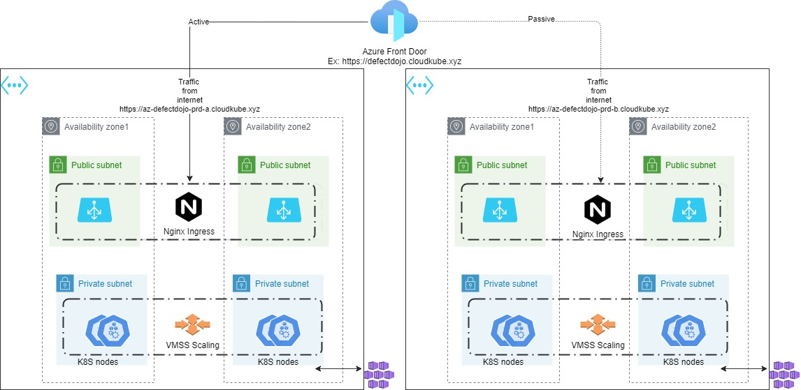
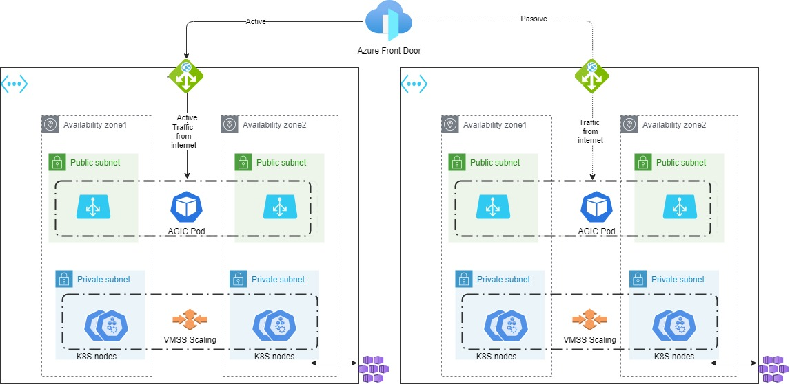

# Introduction 
This repo will build an AKS or EKS cluster and bootstrap it with the below configuration :
# Cluster Setup and Configuration

- Dev
  Dev cluster is deployed in a single region with the enviroments, Dev, QA, Staging being split via K8S namespaces.
  The application URL is exposed via FrontDoor service which is globally redundant. The backend member is application gateway that sends the traffic to the Nginx ingress controller.
- Prod
  Prod cluster is deployed either in sigle region or across 2 regions, depending on how the script is run.
  The application URL is exposed via FrontDoor service which is globally redundant. The backend member is application gateway that sends the traffic to the Nginx ingress controller. The regions are called as PRD-A and PRD-B, and are in active passive mode. 
  If traffic needs to be routed from the secondary region, make changes to the FrontDoor application using the scripts/workflow.
  ## AKS ingress flow
  ### Nginx as ingress
  
  ### Application Gateway(AGIC) as ingress
  

## AKS specific instructions
- DefectDojo and SonarQube uses dynamic volumes and are regional resources. The data in these apps are not relicated like a Globally redundant storage account. The Git workflow ensures to update the apps running on both regios and there by keeps them in sync.
- For applications data dont use Dynamic volumes rather use Azure resources like Storage account with GRS, Azure SQL, KeyVault etc that have native globally redundant options available.

# Authentication and Authorization
## AKS only
- RBAC enabled cluster with 3 nodepools. One is mandatory systempool to run pods in kube-system namespace.
The other 2 are optional, edit the Terraform files to update the desired size and number of max/min nodes. The pools are also labelled, so pods will be placed based on node selectors or affinity.
## AKS and EKS 
- Creates the following resources in k8s
    - NS: dev, qa, devops-addons, ingress and monitoring.
    - svcaccounts: build-robot account with automountServiceAccountToken: false
    - rbac: 
        * k8s role to bind Azure AD group aks-dev-admins to have admin rights on dev namespace.
        * k8s role to bind Azure AD group aks-qa-admins to have admin rights on qa namespace.
        * cluster wide role to grant Azure AD group aks-dev-clus-admins to have admin rights on the Dev cluster.
# Log Monitoring

## AKS only
- If you choose to use Azure Log analytics, run the script with the parameter K8SLogMonitoringType and K8SMetricsMonitoringType set to OMS.
  For example, 
  .\k8s-core-resourcesv2.ps1 -createSPNifNotExists4K8S "true" -k8sEnvironment DEV -K8SLogMonitoringType OMS -K8SMetricsMonitoringType OMS
## AKS and EKS
- If you choose to use EFK stack, use the below parameters.
  .\k8s-core-resourcesv2.ps1 -createSPNifNotExists4K8S "true" -k8sEnvironment DEV -K8SLogMonitoringType EFKinCluster 
# Metrics Monitoring

## AKS only
- If you choose to use Azure Log analytics, run the script with the parameter K8SLogMonitoringType and K8SMetricsMonitoringType set to OMS.
  For example, 
  .\k8s-core-resourcesv2.ps1 -createSPNifNotExists4K8S "true" -k8sEnvironment DEV -K8SLogMonitoringType OMS -K8SMetricsMonitoringType OMS
## AKS and EKS
- If you choose to use Promtheus in Thanos configuration, use the below parameters.
  .\k8s-core-resourcesv2.ps1 -createSPNifNotExists4K8S "true" -k8sEnvironment DEV -K8SMetricsMonitoringType HAPrometheus-Thanos 

# Audit logging

## AKS only
- If you chose Azure log analytics then the control plane logs can be queried using Azure monitor to alert for sensitve operations like K8S secrets read, creating/deleting deployments etc.
Review the azmonitor.tf to add more queries as per your needs. Note that Log analytics can be expensive, and for a cluster size with 100 nodes max size during business hours, Log analytics cost per month would be AUD 30 per month = 3000 AUD per month
For Azure deployment follow the instructions in https://github.com/g0pinath/k8s-core-infra/blob/master/az-aks/readme.md

# DevSecOps Toolkit

## AKS only.
- Azure security policies are enabled if you chose OMS as the monitoring type. 
  Note that the K8S Pod Security Policies and Azure Policies are not compatible.

## AKS and EKS
- DefectDojo is used to host the reports from kube-bench and anchore.
    - kube-bench - This validates the cluster against CIS benchmarks on a daily basis. The pod logs are read by a cronjob running on git, and is sent to DefectDojo as a post.
    anchore - This validates the container images in the cluster and reports any vulnerability. The reports are sent to DefectDojo.
    - SonarQube - this is optional and is used for repos whose source code can be compiled directly. SonarQube cant be used to scan Docker images or code base.
    To enable DefectDojo and SonarQube.
    .\k8s-core-resourcesv2.ps1 -createSPNifNotExists4K8S "true" -k8sEnvironment DEV -requireDefectDojo true requireSonarQube true
    - OPA Gatekeeper policies - applies 10 baseline policies, review https://github.com/g0pinath/k8s-core-infra/blob/master/devsecops/k8s-templates/opa-gatekeeper/Readme.md for more details

 ### Login: Members of dev-devsecops-admins Azure AD group are authorized to login to Grafana, DefectDojo and SonarQube via SSO. 
 Refer https://github.com/g0pinath/k8s-core-infra/blob/develop/devsecops/readme.md for more details on this.

 # Maintainence stuff

## AKS only
- Kured is used for rebooting the worker nodes after patching. Review kured-1.4.5.yml and make changes as required. Default values for reboot is Mon-Sun between 11 pm and 5 am AEST.

# Detailed implementation steps

For a detailed implementation steps, refer the below link.

https://github.com/g0pinath/k8s-core-infra/blob/develop/az-aks/readme.md

# Option:1 Deployment from GitHub Actions and Workflows

Run the below to create the required SPNs and check them into keyvault. This needs to be run from local PC while logged into Azure with contributor access level on the subscription. 
### Important Note: Be sure to be logged into Azure via Powershell and Az CLI before running the below

        DEV:
        - .\k8s-core-resourcesv2.ps1 -createSPNifNotExists4K8S "true" -k8sEnvironment DEV -dryRunforGithubActions "true"
        PRD:
        - .\k8s-core-resourcesv2.ps1 -createSPNifNotExists4K8S "true" -k8sEnvironment PRD -dryRunforGithubActions "true"
### GitHub Secrets
For a list of secrets to be created refer https://github.com/g0pinath/k8s-core-infra/blob/develop/GitSecretsList.md
### Workflow Status
 | Name | Trigger | Status |
  | - | - | - |
  Release Drafter | When a Git release is published. |  
  AzDev-Kube-Bench-Kube-hunter-reports | When a PR is approved into main branch. |  
  AzDev-Core-Infra-Deployment | on commit to Develop branch. | 
  Slack Notifications | on Git events PR, deployment, commit, release etc. | 
  LintCodeBase |on a commit on any branch|| 
  create-release-package|publish the package for every release|| 
-----------------------------------------------------------------------------------------------------------------------------------------------------
# Option: 2 Deployment from local PC.
## Pre-requisites
Set the below environment variables
### $ENV:TLS_PRIVATE_KEY 
     - openssl pkcs12 -in stardotcloudkubexyz.pfx  -out stardotcloudkubexyz.enc.key  # extract private key from PFX
     - openssl rsa -in stardotcloudkubexyz.enc.key -outform PEM -out stardotcloudkubexyz.key # convert the encrypted key to unencrypted key.
     - $base64string = [Convert]::ToBase64String([IO.File]::ReadAllBytes("$pwd/certs/stardotcloudkubexyz.key")) 
     - The value of $base64string should be set for $env:TLS_PRIVATE_KEY or Git secret TLS_PRIVATE_KEY
### $ENV:DD_AZ_CLIENT_ID 
     - client ID for the SPN defectdojo-nonprod-devsecops
### $ENV:DD_AZ_TENANT_ID 
     - tenant ID for metricon in Azure.
### $ENV:DD_AZ_CLIENT_SECRET 
     - client secret for the SPN defectdojo-nonprod-devsecops
### $env:DD_ADMIN_PWD 
     - initial admin password to login to DefectDojo. You can change this after logging in.
### $env:THANOS_LTR_SAKEY 
     - we are storing prometheus data in Azure storage account for LTR. We are currently using sametdevopsnp01 account's key for this var. This can also be set to use S3 instead of Azure storage.
### $env:smtp_auth_password 
     - if you need SMTP email alerts if something is wrong in K8S cluster, and if the SMTP server needs authentication. 
### $env:sonar_admin_password 
     - initial password for sonarqube, if none set defaults to admin

## Executing the script

The following table lists the configurable parameters of the nginx-ingress chart and their default values.

Parameter | Description | Default
--- | --- | ---
`K8SLogMonitoringType` | which log monitoring type is required for K8S - OMS or EFKinCluster or ElasticInCloud or None or | `EFKinCluster`
`K8SMetricsMonitoringType` | which type of metrics monitoring is required for K8S - "OMS"or"HAPrometheus-Thanos"or"SingleInstancePrometheus"or"None" | `HAPrometheus-Thanos`
`requireDefectDojo` | is defectdojo installation required - true or false | `true`
`requireSonarQube` | is sonarqube installation required - true or false | `true`
`cloudProvider` | name of the cloud provider - az | `az`
`createSPNifNotExists4K8S` | create cluster SPN, Grafana SPN and DefectDojo SPN - true or false | `true`
`dryRunforGithubActions` | dry run just creates the required SPNs and skips applying TF, K8S templates - true or false | `false`
`applyTFTemplates` | to skip or apply terraform infra code - true or false | `true`
`serviceMeshType` | service mesh type - linkerd | `linkerd`
`k8sEnvironment` | which environment is this? - DEV or PRD | `DEV`
`requireTLSSecrets` | is TLS required for apps - true or false | `false`
`requireAzureFrontDoor` | is FrontDoor required - true or false | `true`
`productionClusterConfigType` | Prod HA configuration - PrimaryRegionOnly or PrimaryandSecondaryRegion | `PrimaryandSecondaryRegion`
`IngressController` | which ingress controller to use - Nginx or AppGW | `Nginx`
`Policies` | to user AzPolicies or your gatekeeper policies - AzPolicy or DIY-GateKeeper | `DIY-GateKeeper`
`DEFAULT_DEV_K8S_SPN_NAME` | SPN Name for the K8S | `dev-k8s-cluster-spn`
`DEFAULT_DEV_K8S_RG_NAME` | RG name where the AKS will exist | `RG-DEV-K8S-CLUSTER`
`DEFAULT_DEV_K8S_NODE_RG_NAME` | RG name of the AKS nodes | `RG-DEV-K8S-NODES`
`DEFAULT_DEV_AZ_LOCATION` | Azure location | `Australia East`
`DEFAULT_DEV_DD_SPN_NAME` | SPN name for DefectDojo in Dev | `dev-defectdojo-sso-spn`
`DEFAULT_DEV_GRAFANA_SPN_NAME` | SPN name for Grafana in Dev | `dev-grafana-sso-spn`
`DEFAULT_DEV_URL_SUFFIX` | DNS suffix your Org owns | `cloudkube.xyz`
`DEFAULT_PRD_K8S_SPN_NAME` | SPN Name for the K8S | `prd-k8s-cluster-spn`
`DEFAULT_PRD_A_K8S_RG_NAME` | RG name where the AKS will exist | `RG-PRD-A-K8S-CLUSTER`
`DEFAULT_PRD_B_K8S_RG_NAME` | RG name where the AKS will exist | `RG-PRD-B-K8S-CLUSTER`
`DEFAULT_PRD_A_K8S_NODE_RG_NAME` | RG name of the AKS nodes | `RG-PRD-A-K8S-NODES`
`DEFAULT_PRD_B_K8S_NODE_RG_NAME` | RG name of the AKS nodes | `RG-PRD-B-K8S-NODES`
`DEFAULT_PRD_A_AZ_LOCATION` | Azure location | `Australia East`
`DEFAULT_PRD_B_AZ_LOCATION` | Azure location | `southeastasia`
`DEFAULT_PRD_DD_SPN_NAME` | SPN name for DefectDojo in Dev | `prd-defectdojo-sso-spn`
`DEFAULT_PRD_GRAFANA_SPN_NAME` | SPN name for Grafana in Dev | `prd-grafana-sso-spn`
`DEFAULT_PRD_URL_SUFFIX` | DNS suffix your Org owns | `cloudkube.xyz`
