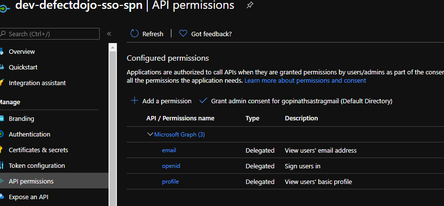

# Introduction 
The below are some notes to setup DevSecOps tool set.

# DefectDojo

## Manual steps for DefectDojo Azure AD integration
The Azure AD App needs permission to read Azure Graph API's to be able to access user info.

    
## Note:

The redirect URI must have a suffix of /complete/azuread-tenant-oauth2/ and will be taken care the script.
Refer https://defectdojo.readthedocs.io/en/latest/social-authentication.html

If you uninstalled DefectDojo release and redeploy, it errors out being unable to connect to Postgres SQL.
Container logs for uwsgi will keep saying defejectdojo credentials are incorrect.
Delete the namespace and redeploy for this.

### what is the defectdojo URL?
You need to set a domain suffix in the main script, I have set mine as cloudkube.xyz which I own. With domain suffix as cloudkube.xyz the URL via frontdoor is

Dev: https://defectdojo-dev.cloudkube.xyz
Prod: https://defectdojo.cloudkube.xyz

To access the URL via Nginx directly use

Dev: https://az-defectdojo-dev.cloudkube.xyz
PRD-A: https://az-defectdojo-prda.cloudkube.xyz
PRD-B: https://az-defectdojo-prdb.cloudkube.xyz

### What are the DNS records that need to be published.
   #### HostName Record(aka A record)  pointing as below
    Dev: az-defectdojo-dev.cloudkube.xyz to the public IP of Nginx on Dev cluster
    PRD-A: az-defectdojo-prda.cloudkube.xyz to the public IP of Nginx on PRD-A cluster
    PRD-B: az-defectdojo-prdb.cloudkube.xyz to the public IP of Nginx on PRD-B cluster
   #### CNAME Record(aka alias record)  pointing as below
    Dev: defectdojo-dev.cloudkube.xyz to cloudkube-dev.azurefd.net 
    PROD: defectdojo.cloudkube.xyz to cloudkube.azurefd.net 
    Backend will point to az-defectdojo-prda.cloudkube.xyz or az-defectdojo-prdb.cloudkube.xyz